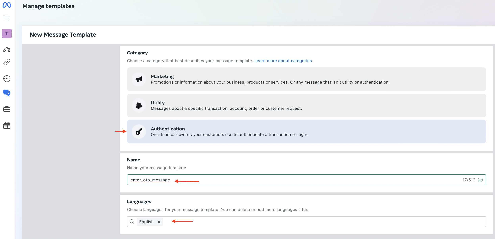

# How to use WhatsApp to send Amazon Cognito notification messages.

 

# Overview

By default, Amazon Cognito uses Amazon Simple Notification Service (Amazon SNS) to deliver SMS text messages. Cognito also supports custom triggers allowing you to invoke an AWS Lambda 
function to support additional providers such as WhatsApp.

# Prerequisites

[Create an AWS account](https://portal.aws.amazon.com/gp/aws/developer/registration/index.html) if you don’t already have one and sign in. [The AWS Identity and Access Management (IAM)](https://aws.amazon.com/iam) role that you use must have sufficient permissions to make the necessary AWS service calls and manage AWS resources such as creating and updating Lambda functions, Amazon Cognito user pools, Secrets Manager, AWS KMS keys, and IAM roles.

. A Meta (Facebook) developer account. For more details go to the [Meta for Developers console](https://developers.facebook.com/).

. [Git](https://git-scm.com/book/en/v2/Getting-Started-Installing-Git) installed.

. [AWS Cloud Development Kit (AWS CDK) Toolkit](https://docs.aws.amazon.com/cdk/latest/guide/cli.html) installed and configured.

. [Node.js with NPM](https://nodejs.org/en/download/) installed.

. [Docker](https://docs.aws.amazon.com/serverless-application-model/latest/developerguide/install-docker.html) installed and running.

# Steps

# 1. Create and configure an app for WhatsApp communication

  . Open the [Meta for Developers](https://developers.facebook.com/) console, choose My Apps and then choose Create App.

   

  # 
  
  . Select Other choose Next and then select Business as the app type and choose Next.

   

   # 
  
  . Enter an App name and app contact email, choose whether or not to attach a Business portfolio and choose Create app.

   # 
  
  . Open the app Dashboard and in the Add product to your app section, under WhatsApp, choose Set up.

   # 
  
  . Create https://www.facebook.com/business or select an existing Meta business portfolio and choose Continue.

   # 
  
  . In the left navigation pane, under WhatsApp, choose API Setup.

   # 
  
  . Under Send and receive messages, take note of the Phone number ID, which will be needed in the AWS CDK template later.

   . Under To, add the customer phone number you want to use for testing. Select Manage Phone Number list and Follow the instructions to add and verify the phone number.

   
  
 
   __Note: You must have WhatsApp registered with the number and the WhatsApp client installed on your mobile device.__

  # 2. Create a user for accessing WhatsApp
  Create a system user in Meta’s Business Manager and assign it to the app created in the previous step. The access tokens generated for this user will be used to make the WhatsApp API   calls.

# To create a user

. Open Meta’s [Business Manager](https://business.facebook.com/settings/) and select the business you created or associated your application with earlier from the dropdown menu under          Business Settings.

  

. Under Users, select System Users and then choose Add to create a new system user.

   

. Enter a name for the System Username and set their role as Admin and choose Create system user.

. Choose Assign assets.

   

. From the Select asset type list, select Apps. Under Select Assets, select your WhatsApp application’s name. Under Partial access, turn on the Test app option for the user. Choose Save    Changes and then choose Done. 

. Choose Generate New Token, select the WhatsApp application created earlier, and leave the default 60 days as the token expiration. Under Permissions select WhatsApp_business_messaging and   WhatsApp_business_management and choose Generate Token at the bottom. 

  

  

. Copy and save your access token. You will need this for the AWS CDK template later. Choose OK.

# 3. Create a template in WhatsApp

  Create a template for the verification messages that will be sent by WhatsApp.

  __To create a template__

  . Open Meta’s WhatsApp Manager.

  . On the left icon pane, under Account tools, choose Message template and then choose Create Template.

  
  
  . Select Authentication as the category.

  . For the Name, enter otp_message.

  . For Languages, enter English.

  . Choose Continue.

  

  . In the next screen, select Copy code and choose Submit.

  

  . Template Created 

  __Note: Teplate Status review can take upto 12hr before becoming Active__

  # 

# 4. Create a Secrets Manager secret

Use the Secrets Manager console to create a Secrets Manager secret and set the secret to the WhatsApp access token.

__To create a secret__

. Open the AWS Management Console and go to Secrets Manager.

. Choose Store a new secret.

   
   

. Under Choose a secret type, choose Other type of secret and under Key/value pairs, select the Plaintext tab and enter Bearer followed by the WhatsApp access token (Bearer<WhatsAppaccesstoken>).

  

. For the encryption key, you can use either the AWS KMS key that Secrets Manager creates or a customer managed AWS KMS key that you create and then choose Next.

. Provide the secret name as the WhatsAppAccessToken, choose Next, and then choose Store to create the secret.

  

. Note the secret Amazon Resource Name (ARN) to use in later steps.

  

# 4. Deploy the solution

  In this section, you clone the GitHub repository and deploy the stack to create the resources in your account.

  To clone the repository
  
  1. Create a new directory, navigate to that directory in a terminal and use the following command to clone the GitHub repository that has the Lambda and AWS CDK code:

         git clone https://github.com/aws-samples/amazon-cognito-whatsapp-otp

  2. Change directory to the pattern directory:
     
         cd amazon-cognito-whatsapp-otp

# 5. To deploy the stack

  a. Configure the phone number ID obtained from WhatsApp, the secret name, secret ARN, and the [Amazon Cognito user pool self-service sign-up](https://docs.aws.amazon.com/cognito/latest/developerguide/cognito-user-identity-pools.html#cognito-user-pools-features) option in the constants.ts file.
  
  Open the lib/constants.ts file and edit the fields. The SELF_SIGNUP value must be set to true for the purpose of this proof of concept. 
  
  The SELF_SIGNUP value represents the Boolean value   for the Amazon Cognito user pool sign-up option, which when set to true allows public users to sign up.

        export const PHONE_NUMBER_ID = '<phone number ID>'; 
        export const SECRET_NAME = '<WhatsAppAccessToken>'; 
        export const SECRET_ARN = 'arn:aws:secretsmanager:<AWSRegion>:<phone number ID>:secret:<WhatsAppAccessToken>'; 
        export const SELF_SIGNUP = <true>;

        
  b. nstall the AWS CDK required dependencies by running the following command:

          npm install
          
  c. This project uses typescript as the client language for AWS CDK. Run the following command to compile typescript to JavaScript:
     
          npm run build

  d. From the command line, configure AWS CDK (if you have not already done so):
     
          cdk bootstrap <account number>/<AWS Region>

  e. [Install and run Docker](https://docs.aws.amazon.com/serverless-application-model/latest/developerguide/install-docker.html). We’re using the [aws-lambda-python-alpha](https://docs.aws.amazon.com/cdk/api/v2/docs/aws-lambda-python-alpha-readme.html) package in the AWS CDK code to build the Lambda deployment package. The deployment package installs the          required modules in a Lambda compatible Docker container.
     
  To run [aws-lambda-python-alpha](https://docs.aws.amazon.com/cdk/api/v2/docs/aws-lambda-python-alpha-readme.html) and install dependencies, 

  . Inside your project directory, create a requirements.txt file and add the aws-cdk-lib and aws-lambda-python-alpha dependencies:

        aws-cdk-lib
        constructs
        aws-cdk.aws-lambda-python-alpha

  . You need to manually Create a virtualenv on MacOs and Linux 

        $ python3 -m venv .venv

  . Activate your Environment 

        $ source .venv/bin/activate

  . Install the dependencies:

        pip install -r requirements.txt

 f. Deploy the stack:
    
        cdk synth
    
        cdk deploy --all

# 6. Test the solution

. Open [AWS CloudFormation](https://aws.amazon.com/cloudformation) console.

. Select the WhatsappOtpStack that was deployed through AWS CDK.

. On the Outputs tab, copy the value of cognitocustomotpsenderclientappid.

. Run the following [AWS Command Line Interface (AWS CLI)](https://aws.amazon.com/cli) command, replacing the client ID with the output of cognitocustomotpsenderclientappid, username,         password, email address, name, phone number, and AWS Region to sign up a new Amazon Cognito user.

        aws cognito-idp sign-up --client-id <cognitocustomsmssenderclientappid> --username <TestUserPhoneNumber> --password <Password> --user-attributes Name="email",Value="                        <TestUserEmail>" Name="name",Value="<TestUserName>" Name="phone_number",Value="<TestPhoneNumber>" --region <AWS Region>

Example:

      aws cognito-idp sign-up --client-id xxxxxxxxxxxxxx --username +12065550100  --password Test@654321 --user-attributes Name="email",Value="jane@example.com" Name="name",Value="Jane"           Name="phone_number",Value=”+12065550100" --region us-east-1

__Note: Password requirements are a minimum length of eight characters with at least one number, one lowercase letter, and one special character.__

The new user should receive a message on WhatsApp with a verification code that they can use to complete their sign-up.

# Cleanup

Run the following command to delete the resources that were created. It might take a few minutes for the CloudFormation stack to be deleted.

      cdk destroy --all

Delete the secret WhatsAppAccessToken that was created from the Secrets Manager console.

# Conclusion

In this post, We have showed you with pictures how to use an alternative messaging platform such as WhatsApp to send notification messages from Amazon Cognito. This functionality is enabled through the Amazon Cognito custom SMS sender trigger, which invokes a Lambda function that has the custom code to send messages through the WhatsApp API. 

You can use the same method to use other third-party providers to send messages.

 

